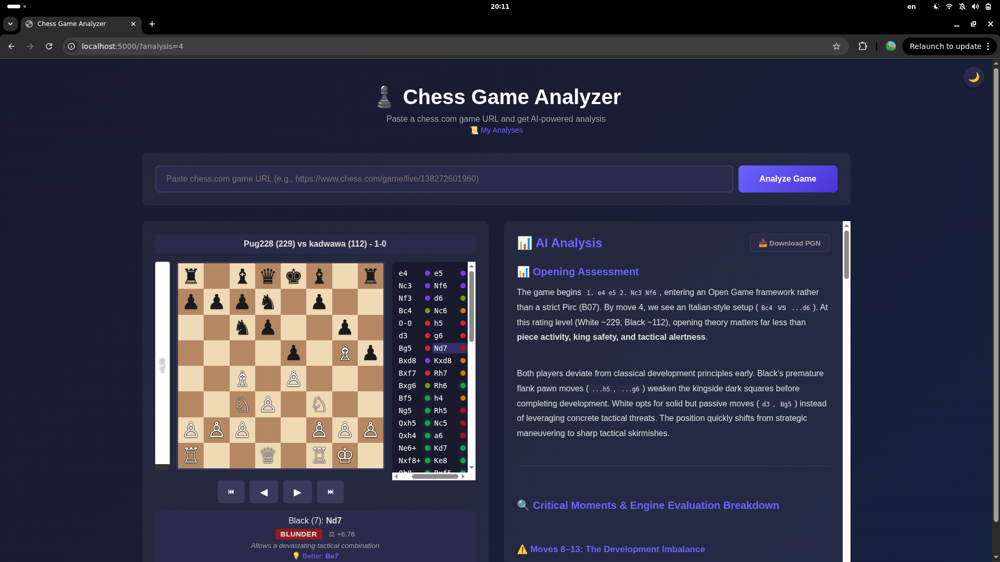
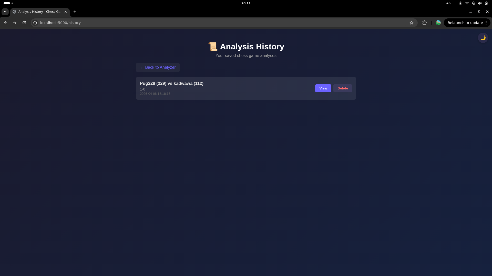
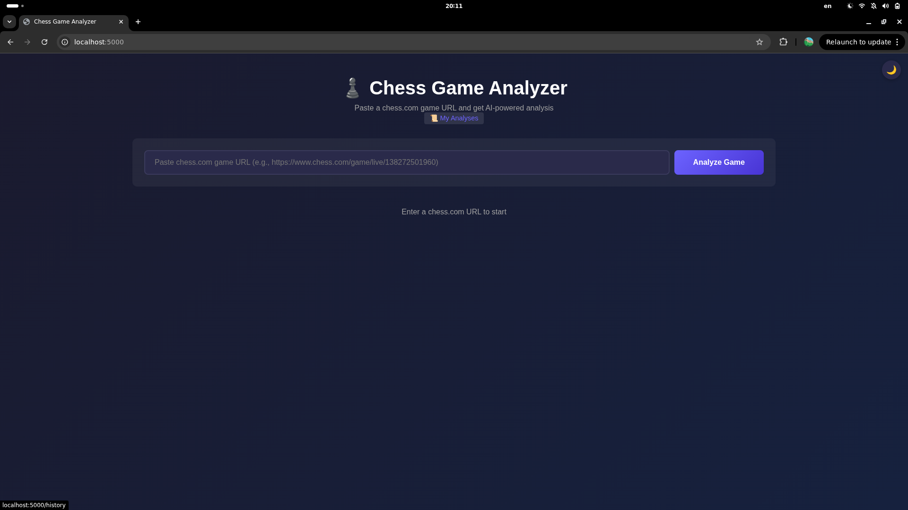

# ♟️ Chess Game Analyzer

**Analyze any chess.com game with AI-powered engine evaluations and expert commentary — just paste the game URL.**

---

## 📸 Demo

### Board Analysis — Dark Mode


### Evaluation Bar & Move List


### Light Mode


---

## 📋 Product Context

### End Users
- **Chess players** of all levels who want to review their games from chess.com
- **Chess coaches** who need quick, accurate game analysis for their students
- **Chess learners** looking to understand their mistakes and improve

### Problem
- Chess.com's built-in analysis requires a premium subscription
- Free engine analysis tools are standalone apps — no web-based, integrated solution
- LLM-only analysis tools produce inaccurate tactical evaluations (e.g., calling blunders "good moves")

### Our Solution
A web app that combines:
1. **Stockfish 17.1** (NNUE neural network) for **accurate, objective** move evaluations
2. **AI commentary** (via local LLM) for **human-readable explanations** of why each move is good or bad
3. An **interactive chessboard** with a move list, evaluation bar, and full PGN export — all in one page

---

## ✅ Features

### Implemented
- ✅ Paste any chess.com live/daily game URL to analyze
- ✅ Stockfish 17.1 with NNUE (4 threads, 256MB hash)
- ✅ 7-level move classification: Brilliant, Excellent, Good, Book, Inaccuracy, Mistake, Blunder
- ✅ Detailed per-move explanations with 💡 best-move suggestions
- ✅ Interactive board with smooth piece transition animations
- ✅ Evaluation bar showing engine score at each position
- ✅ Scrollable move list with color-coded evaluation dots
- ✅ AI-generated game commentary (via OpenAI-compatible LLM API)
- ✅ Markdown table rendering in analysis output
- ✅ PGN export with Stockfish comments and NAG symbols
- ✅ Analysis history — saved automatically in SQLite, viewable at `/history`
- ✅ Loading progress indicator (4 animated steps)
- ✅ Dark / Light theme toggle (persisted in localStorage)
- ✅ Mobile swipe navigation on the board
- ✅ Opening name display from ECO code
- ✅ Proxy support for restricted regions

### Planned (not yet implemented)
- [ ] PGN import (upload your own PGN files)
- [ ] Multi-game batch analysis
- [ ] Shareable analysis links
- [ ] Opening wiki links and preparation tips
- [ ] User authentication (optional)
- [ ] Video/PDF report generation

---

## 🚀 Usage

1. Open `http://localhost:5000` in your browser
2. Paste a chess.com game URL (e.g., `https://www.chess.com/game/live/138272501960`)
3. Click **Analyze Game**
4. Watch the real-time progress (fetching → Stockfish → AI commentary)
5. Navigate moves with **◀▶ buttons**, **keyboard arrows**, or **swipe** on mobile
6. View the AI analysis panel with formatted commentary and tables
7. Click **📥 Download PGN** to save the annotated game
8. Visit **📜 My Analyses** to browse, re-open, or delete past analyses

---

## 🛠 Deployment

### Prerequisites
- **OS:** Ubuntu 24.04 LTS (or any Linux with Docker support)
- **Hardware:** 4+ CPU cores, 4+ GB RAM (Stockfish uses multi-threading)
- **Software:** Docker Engine + Docker Compose (v2)

### Installation

```bash
# 1. Install Docker (Ubuntu 24.04)
sudo apt update
sudo apt install -y ca-certificates curl
sudo install -m 0755 -d /etc/apt/keyrings
sudo curl -fsSL https://download.docker.com/linux/ubuntu/gpg -o /etc/apt/keyrings/docker.asc
sudo chmod a+r /etc/apt/keyrings/docker.asc
echo \
  "deb [arch=$(dpkg --print-architecture) signed-by=/etc/apt/keyrings/docker.asc] \
  https://download.docker.com/linux/ubuntu $(. /etc/os-release && echo "$VERSION_CODENAME") stable" | \
  sudo tee /etc/apt/sources.list.d/docker.list > /dev/null
sudo apt update
sudo apt install -y docker-ce docker-ce-cli containerd.io docker-buildx-plugin docker-compose-plugin

# 2. Verify installation
docker --version
docker compose version

# 3. (Optional) Run Docker without sudo
sudo usermod -aG docker $USER
newgrp docker
```

### Configuration

Before deployment, edit `app.py` to set your LLM API details:

```python
LLM_API_URL = "http://your-llm-host:port"   # Your OpenAI-compatible API endpoint
LLM_API_KEY = "your-api-key"               # API key (leave empty if not required)
CHESSCOM_PROXIES = { ... }                 # Proxy config (remove if not needed)
```

### Run

```bash
# Clone the repository
git clone https://github.com/pug228/se-toolkit-hackathon.git
cd se-toolkit-hackathon

# Build and start
docker compose up -d --build

# Check it's running
docker compose ps

# View logs
docker compose logs -f
```

Open `http://<your-server-ip>:5000` in a browser.

### Stop

```bash
docker compose down
```

### Notes
- The SQLite database (`data/analyses.db`) is stored in a named Docker volume — it persists across container restarts
- Stockfish 17.1 with NNUE is installed automatically during the Docker build
- All chess.com requests go through the configured proxy (edit `CHESSCOM_PROXIES` in `app.py` or remove if not needed)
